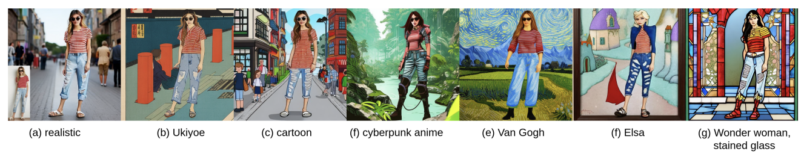

# awesome-customized-generative-AI
Papers and codes collection for customize, personalized and editable generative models in 2D and 3D domains.

## Introduction
Artificial Intelligence Generated Content (AIGC) has become ubiquitous, demonstrating the power of generating mesmerizing results of random portraits. However, users generally show greater interest in personalized information (for example, faces from familiar people or celebrities) in these generated results than in generic faces. This tendency toward customization in AIGC arouses attention to customized, personalized, and editable generative AI. 

This repo mainly focuses on visual generative models (leaving out LLMs), including 2D image-to-image, 2D text-to-image, and text-guided 3D generation/manipulation, collecting customized, personalized, and editable works in these specific domains. For any addition about other 2D/3D AIGC domains or bugs report, please open an issue, pull requests, or e-mail me at `normanzheng6606@gmail.com` for better communication.

Frequantly updating, please stay tuned!

## Table of Contents
- [Customized 2D Image-to-Image](#customized-2d-image-to-image)
  - [Image-prompted Generation](#image-prompted-generation)
  - [Portrait Style Transfer](#portrait-style-transfer)
  - [Interactive Image Editing](#interactive-image-editing)

- [Customized 2D Text-to-Image](#customized-2d-text-to-image)
  - [Text-guided Portrait Generation](#text-guided-portrait-generation)
  - [Text-guided Image Editing](#text-guided-image-editing)

- [Customized 3D Generation/Manipulation](#customized-3d-generationmanipulation)
  - [Image-prompted 3D Generation](#image-prompted-3d-generation)
  - [Text-prompted 3D Manipulation](#text-prompted-3d-manipulation)

- [Customized Video Generation](#customized-video-generation)
  - [Image-prompted Video Generation](#image-prompted-video-generation)
  - [Text-prompted Video Generation](#text-prompted-video-generation)

- [Other Resources](#other-resources)
  - [Generic Datasets](#generic-datasets)
  - [Generic Pre-trained Models](#generic-pre-trained-models)

## Customized 2D Image-to-Image

### Image-prompted Generation   

#### 2024

- FreeControl: Training-Free Spatial Control of Any Text-to-Image Diffusion Model with Any Condition `CVPR2024` [{Paper}](https://arxiv.org/abs/2312.07536) [{Code}](https://github.com/genforce/freecontrol.git) [{Webpage}](https://genforce.github.io/freecontrol/?utm_source=catalyzex.com) 

Details

   

- Face2Diffusion for Fast and Editable Face Personalization `CVPR2024` [{Paper}](https://arxiv.org/abs/2403.05094) [{Code}](https://github.com/mapooon/face2diffusion) [{Webpage}](https://mapooon.github.io/Face2DiffusionPage/)

Details

   

- InstantID: Zero-shot Identity-Preserving Generation in Seconds `arxiv` [{Paper}](https://arxiv.org/abs/2401.07519) [{Code}](https://github.com/InstantID/InstantID.git) [{Webpage}](https://instantid.github.io/)

Details

  

- X-Adapter: Adding Universal Compatibility of Plugins for Upgraded Diffusion Model `CVPR2024` [{Paper}](https://arxiv.org/abs/2312.02238) [{Code}](https://github.com/showlab/X-Adapter.git) [{Webpage}](https://showlab.github.io/X-Adapter/) 

Details

   

- MagiCapture: High-Resolution Multi-Concept Portrait Customization `AAAI2024` [{Paper}](https://arxiv.org/abs/2309.06895) [{Code}](https://github.com/junhahyung/MagiCapture.git) [{Webpage}](https://magicapture.github.io/) 
Also suitable for [Portrait Style Transfer](#portrait-style-transfer)
Details

   

- Texture-Preserving Diffusion Models for High-Fidelity Virtual Try-On `CVPR2024` [{Paper}](https://arxiv.org/abs/2404.01089) [{Code}](https://github.com/gal4way/tpd) 

Details

   

- Orthogonal Adaptation for Modular Customization of Diffusion Models `CVPR2024` [{Paper}](https://arxiv.org/abs/2312.02432) [{Webpage}](https://ryanpo.com/ortha/) 
Also suitable for [Text-guided Portrait Generation](#text-guided-portrait-generation)
Details

   

- High-fidelity Person-centric Subject-to-Image Synthesis `CVPR 2024` [{Paper}](https://arxiv.org/abs/2311.10329) [{Code}](https://github.com/CodeGoat24/Face-diffuser.git) 
Also suitable for [Text-guided Portrait Generation](#text-guided-portrait-generation)
Details

   

- Coarse-to-Fine Latent Diffusion for Pose-Guided Person Image Synthesis `CVPR 2024` [{Paper}](https://arxiv.org/abs/2402.18078) [{Code}](https://github.com/YanzuoLu/CFLD.git)

Details

   

- Non-confusing Generation of Customized Concepts in Diffusion Models `ICML 2024` [{Paper}]() [{Code}](https://github.com/clif-official/clif_code.git) [{Webpage}](https://clif-official.github.io/clif/) 
Also suitable for [Text-guided Portrait Generation](#text-guided-portrait-generation)
Details

  

- MC2: Multi-concept Guidance for Customized Multi-concept Generation `arxiv` [{Paper}](https://arxiv.org/abs/2404.05268) [{Code}](https://github.com/JIANGJiaXiu/MC-2.git) 

Details

  

- ToonCrafter: Generative Cartoon Interpolation `arxiv` [{Paper}](https://arxiv.org/abs/2405.17933) [{Code}](https://github.com/ToonCrafter/ToonCrafter) [{Webpage}](https://doubiiu.github.io/projects/ToonCrafter/) 

Details

   

#### 2023

- IP-Adapter: Text Compatible Image Prompt Adapter for Text-to-Image Diffusion Models `arxiv` [{Paper}](https://arxiv.org/abs/2308.06721) [{Code}](https://github.com/tencent-ailab/IP-Adapter.git) [{Webpage}](https://ip-adapter.github.io/) 
Also suitable for [Text-guided Portrait Generation](#text-guided-portrait-generation)
Details

  

- ViscoNet: Bridging and Harmonizing Visual and Textual Conditioning for ControlNet `arxiv` [{Paper}](https://arxiv.org/abs/2312.03154) [{Code}](https://github.com/soon-yau/visconet.git) [{Webpage}](https://soon-yau.github.io/visconet/) 
Also suitable for [Text-guided Image Editing](#text-guided-image-editing) and [Portrait Style Transfer](#portrait-style-transfer)
Details

  

- When StyleGAN Meets Stable Diffusion: a 𝒲+ Adapter for Personalized Image Generation `arxiv` [{Paper}](arxiv.org/abs/2311.17461) [{Code}](https://github.com/csxmli2016/w-plus-adapter) 

Details

  

- Real-World Image Variation by Aligning Diffusion Inversion Chain `NeurIPS2023` [{Paper}](https://arxiv.org/abs/2305.18729) [{Code}](https://github.com/dvlab-research/RIVAL.git) [{Webpage}](https://rival-diff.github.io/) 
Also suitable for [Text-guided Portrait Generation](#text-guided-portrait-generation) and [Portrait Style Transfer](#portrait-style-transfer)
Details

  

- MyStyle++: A Controllable Personalized Generative Prior `SIGGRAPH ASIA 2023` [{Paper}](https://arxiv.org/abs/2306.04865) [{Code}](https://github.com/google/mystyle) [{Webpage}](https://mystyle-personalized-prior.github.io/?utm_source=catalyzex.com) 

Details

- Mix-of-Show: Decentralized Low-Rank Adaptation for Multi-Concept Customization of Diffusion Models `NeurIPS2023` [{Paper}](https://arxiv.org/abs/2305.18292) [{Code}](https://github.com/TencentARC/Mix-of-Show.git) [{Webpage}](https://showlab.github.io/Mix-of-Show/) 
Also suitable for [Text-guided Portrait Generation](#text-guided-portrait-generation) 
Details

   

- SingleInsert: Inserting New Concepts from a Single Image into Text-to-Image Models for Flexible Editing `arxiv` [{Paper}](https://arxiv.org/abs/2310.08094) [{Code}](https://github.com/JarrentWu1031/SingleInsert.git) [{Webpage}](https://jarrentwu1031.github.io/SingleInsert-web/)
Also suitable for [Text-guided Portrait Generation](#text-guided-portrait-generation)
Details

   

- Cones 2: Customizable Image Synthesis with Multiple Subjects `NeurIPS2023` [{Paper}](https://arxiv.org/abs/2305.19327) [{Code}](https://github.com/ali-vilab/Cones-V2.git) [{Webpage}](https://cones.github.io/)
Also suitable for [Text-guided Portrait Generation](#text-guided-portrait-generation)
Details

  

- LaDI-VTON: Latent Diffusion Textual-Inversion Enhanced Virtual Try-On `ACM MM 2023` [{Paper}](https://arxiv.org/abs/2305.13501) [{Code}](https://github.com/miccunifi/ladi-vton) 

Details

  

#### 2022

- MyStyle: A Personalized Generative Prior `{ACM} Trans. Graph.` [{Paper}](https://arxiv.org/abs/2203.17272) [{Code}](https://github.com/google/mystyle) [{Webpage}](https://mystyle-personalized-prior.github.io/?utm_source=catalyzex.com) 

Details

  

### Portrait Style Transfer

#### 2024

- InstantStyle: Free Lunch towards Style-Preserving in Text-to-Image Generation `arxiv` [{Paper}](https://arxiv.org/abs/2404.02733) [{Code}](https://github.com/InstantStyle/InstantStyle.git)

Details

  

- DEADiff: An Efficient Stylization Diffusion Model with Disentangled Representations `CVPR 2024` [{Paper}](https://arxiv.org/abs/2403.06951) [{Code}](https://github.com/bytedance/DEADiff.git) [{Webpage}](https://tianhao-qi.github.io/DEADiff/) 

Details

  

- Customizing Text-to-Image Models with a Single Image Pair `arxiv` [{Paper}](https://arxiv.org/abs/2405.01536)  

Details

  

#### 2023

- ViscoNet: Bridging and Harmonizing Visual and Textual Conditioning for ControlNet `arxiv` [{Paper}](https://arxiv.org/abs/2312.03154) [{Code}](https://github.com/soon-yau/visconet.git) [{Webpage}](https://soon-yau.github.io/visconet/) 
Also suitable for [Image-prompted Generation](#image-prompted-generation) and [Text-guided Image Editing](#text-guided-image-editing)
Details

  

- DemoCaricature: Democratising Caricature Generation with a Rough Sketch `arxiv` [{Paper}](https://arxiv.org/abs/2312.04364) [{Webpage}](https://democaricature.github.io/?utm_source=catalyzex.com) 

Details

  

- Real-World Image Variation by Aligning Diffusion Inversion Chain `NeurIPS2023` [{Paper}](https://arxiv.org/abs/2305.18729) [{Code}](https://github.com/dvlab-research/RIVAL.git) [{Webpage}](https://rival-diff.github.io/) 
Also suitable for [Image-prompted Generation](#image-prompted-generation) and [Text-guided Portrait Generation](#text-guided-portrait-generation) 
Details

  

- ArtAdapter: Text-to-Image Style Transfer using
Multi-Level Style Encoder and Explicit Adaptation `arxiv` [{Paper}](https://arxiv.org/abs/2312.02109) [{Code}](https://github.com/cardinalblue/ArtAdapter.git) [{Webpage}](https://cardinalblue.github.io/artadapter.github.io/) 

Details

  

### Interactive Image Editing

#### 2024

- Transparent Image Layer Diffusion using Latent Transparency `arxiv` [{Paper}](https://arxiv.org/abs/2402.17113) [{Code}](https://github.com/layerdiffusion/sd-forge-layerdiffuse.git)
**Powerful PhotoShop cutout replacement!**
Details

  

- MagiCapture: High-Resolution Multi-Concept Portrait Customization `AAAI2024` [{Paper}](https://arxiv.org/abs/2309.06895) [{Code}](https://github.com/junhahyung/MagiCapture.git) [{Webpage}](https://magicapture.github.io/) 
Also suitable for [Image-prompted Generation](#image-prompted-generation)
Details

   

- MIGC: Multi-Instance Generation Controller for Text-to-Image Synthesis `CVPR 2024` [{Paper}](https://arxiv.org/abs/2402.05408) [{Code}](https://github.com/limuloo/MIGC.git) [{Webpage}](https://migcproject.github.io/) 
Also suitable for [Image-prompted Generation](#image-prompted-generation)
Details

   

- LocInv: Localization-aware Inversion for Text-Guided Image Editing `arxiv` [{Paper}](https://arxiv.org/abs/2405.01496) 

Details

   

- IDM-VTON : Improving Diffusion Models for Authentic Virtual Try-on in the Wild `arxiv` [{Paper}](https://arxiv.org/abs/2403.05139) [{Code}](https://github.com/yisol/IDM-VTON.git) [{Webpage}](https://idm-vton.github.io/) 

Details

   

#### 2023

- Drag Your GAN: Interactive Point-based Manipulation on the Generative Image Manifold `SIGGRAPH 2023` [{Paper}](https://arxiv.org/abs/2305.10973) [{Code}](https://github.com/XingangPan/DragGAN.git) [{Webpage}](https://vcai.mpi-inf.mpg.de/projects/DragGAN/)
Interactive manipulation of the generative image manifold!
Details

   

- DragDiffusion: Harnessing Diffusion Models for Interactive Point-based Image Editing `CVPR 2024` [{Paper}](https://arxiv.org/abs/2306.14435) [{Code}](https://github.com/Yujun-Shi/DragDiffusion.git) [{Webpage}](https://yujun-shi.github.io/projects/dragdiffusion.html)

Details

   

## Customized 2D Text-to-Image

### Text-guided Portrait Generation

#### 2024

- FlashFace: Human Image Personalization with High-fidelity Identity Preservation `arxiv` [{Paper}](https://arxiv.org/abs/2403.17008) [{Code}](https://github.com/TencentARC/FlashFace.git) [{Webpage}](https://jshilong.github.io/flashface-page/)

Details

   

- Pick-and-Draw: Training-free Semantic Guidance for Text-to-Image Personalization `arxiv` [{Paper}](https://arxiv.org/abs/2401.16762)

Details

- StableIdentity: Inserting Anybody into Anywhere at First Sight `arxiv` [{Paper}](https://arxiv.org/abs/2401.15975) [{Code}](https://github.com/qinghew/StableIdentity.git) [{Webpage}](https://qinghew.github.io/StableIdentity/)
Also suitable for [Image-prompted 3D Generation](#image-prompted-3d-generation)
Details

  

 

- Towards a Simultaneous and Granular Identity-Expression Control in Personalized Face Generation `arxiv` [{Paper}](https://arxiv.org/abs/2401.01207) 

Details

  

 

- DisenBooth: Identity-Preserving Disentangled Tuning for Subject-Driven Text-to-Image Generation `ICLR2024` [{Paper}](https://arxiv.org/abs/2305.03374) [{Code}](https://github.com/forchchch/DisenBooth.git) [{Webpage}](https://disenbooth.github.io/)

Details

  

 

- DreamMatcher: Appearance Matching Self-Attention
for Semantically-Consistent Text-to-Image Personalization `CVPR2024` [{Paper}](https://arxiv.org/abs/2402.09812) [{Code}](https://github.com/KU-CVLAB/DreamMatcher.git) [{Webpage}](https://ku-cvlab.github.io/DreamMatcher/?utm_source=catalyzex.com)

Details

  

 

- Orthogonal Adaptation for Modular Customization of Diffusion Models `CVPR2024` [{Paper}](https://arxiv.org/abs/2312.02432) [{Webpage}](https://ryanpo.com/ortha/) 
Also suitable for [Image-prompted-Generation](#image-prompted-generation) 
Details

   

- High-fidelity Person-centric Subject-to-Image Synthesis `CVPR 2024` [{Paper}](https://arxiv.org/abs/2311.10329) [{Code}](https://github.com/CodeGoat24/Face-diffuser.git) 
Also suitable for [Image-prompted-Generation](#image-prompted-generation)
Details

   

- Non-confusing Generation of Customized Concepts in Diffusion Models `ICML 2024` [{Paper}]() [{Code}](https://github.com/clif-official/clif_code.git) [{Webpage}](https://clif-official.github.io/clif/) 
Also suitable for [Image-prompted-Generation](#image-prompted-generation)
Details

   

#### 2023

- IP-Adapter: Text Compatible Image Prompt Adapter for Text-to-Image Diffusion Models `arxiv` [{Paper}](https://arxiv.org/abs/2308.06721) [{Code}](https://github.com/tencent-ailab/IP-Adapter.git) [{Webpage}](https://ip-adapter.github.io/) 
Also suitable for [Image-prompted Generation](#image-prompted-generation)
Details

  

- Real-World Image Variation by Aligning Diffusion Inversion Chain `NeurIPS2023` [{Paper}](https://arxiv.org/abs/2305.18729) [{Code}](https://github.com/dvlab-research/RIVAL.git) [{Webpage}](https://rival-diff.github.io/) 
Also suitable for [Image-prompted Generation](#image-prompted-generation) and [Portrait Style Transfer](#portrait-style-transfer) 
Details

   

- Customization Assistant for Text-to-image Generation `arxiv` [{Paper}](https://arxiv.org/abs/2312.03045) [{Code}](https://github.com/drboog/ProFusion.git)

Details

   

- FaceStudio: Put Your Face Everywhere in Seconds `arxiv` [{Paper}](https://arxiv.org/abs/2312.02663) [{Code}](https://github.com/TencentQQGYLab/FaceStudio.git) [{Webpage}](https://icoz69.github.io/facestudio/?utm_source=catalyzex.com)

Details

  

- CustomNet: Zero-shot Object Customization with Variable-Viewpoints in Text-to-Image Diffusion Models `arxiv` [{Paper}](https://arxiv.org/abs/2310.19784) [{Code}](https://github.com/TencentARC/CustomNet.git) [{Webpage}](https://jiangyzy.github.io/CustomNet/?utm_source=catalyzex.com)

Details

   

- Encoder-based Domain Tuning for Fast Personalization of Text-to-Image Models `arxiv` [{Paper}](arxiv.org/abs/2302.12228) [{Code}](https://github.com/mkshing/e4t-diffusion.git)

Details

   

- PhotoVerse: Tuning-Free Image Customization with Text-to-Image Diffusion Models `arxiv` [{Paper}](https://arxiv.org/abs/2309.05793) [{Webpage}](https://photoverse2d.github.io/?utm_source=catalyzex.com) 

Details

   

- PhotoMaker: Customizing Realistic Human Photos via Stacked ID Embedding `arxiv` [{Paper}](https://arxiv.org/abs/2312.04461) [{Code}](https://github.com/TencentARC/PhotoMaker.git) [{Webpage}](photo-maker.github.io/) 

Details

   

- DreamBooth: Fine Tuning Text-to-Image Diffusion Models for Subject-Driven Generation `CVPR2022` [{Paper}](https://arxiv.org/abs/2208.12242) [{Code}](https://github.com/google/dreambooth.git) [{Webpage}](https://dreambooth.github.io/?utm_source=catalyzex.com)

Details

   

- CatVersion: Concatenating Embeddings for Diffusion-Based Text-to-Image Personalization `arxiv` [{Paper}](https://arxiv.org/abs/2311.14631) [{Code}](https://github.com/RoyZhao926/CatVersion.git) [{Webpage}](https://royzhao926.github.io/CatVersion-page/?utm_source=catalyzex.com) 

Details

   

- Subject-Diffusion:Open Domain Personalized Text-to-Image Generation without Test-time Fine-tuning `arxiv` [{Paper}](arxiv.org/abs/2307.11410) [{Code}](https://github.com/OPPO-Mente-Lab/Subject-Diffusion.git) [{Webpage}](https://oppo-mente-lab.github.io/subject_diffusion/)

Details

   

- Mix-of-Show: Decentralized Low-Rank Adaptation for Multi-Concept Customization of Diffusion Models `NeurIPS2023` [{Paper}](https://arxiv.org/abs/2305.18292) [{Code}](https://github.com/TencentARC/Mix-of-Show.git) [{Webpage}](https://showlab.github.io/Mix-of-Show/) 
Also suitable for [Image-prompted Generation](#image-prompted-generation)
Details

   

- HyperDreamBooth: HyperNetworks for Fast Personalization of Text-to-Image Models `arxiv` [{Paper}](https://arxiv.org/abs/2307.06949) [{Code}](https://github.com/JiauZhang/hyperdreambooth.git) [{Webpage}](https://hyperdreambooth.github.io/?utm_source=catalyzex.com)

Details

   

- SingleInsert: Inserting New Concepts from a Single Image into Text-to-Image Models for Flexible Editing `arxiv` [{Paper}](https://arxiv.org/abs/2310.08094) [{Code}](https://github.com/JarrentWu1031/SingleInsert.git) [{Webpage}](https://jarrentwu1031.github.io/SingleInsert-web/)
Also suitable for [Image-prompted Generation](#image-prompted-generation)
Details

   

- Cones 2: Customizable Image Synthesis with Multiple Subjects `NeurIPS2023` [{Paper}](https://arxiv.org/abs/2305.19327) [{Code}](https://github.com/ali-vilab/Cones-V2.git) [{Webpage}](https://cones.github.io/)
Also suitable for [Image-prompted Generation](#image-prompted-generation)
Details

  

- ELITE: Encoding Visual Concepts into Textual Embeddings for Customized Text-to-Image Generation `ICCV 2023` [{Paper}](https://arxiv.org/abs/2302.13848) [{Code}](https://github.com/csyxwei/ELITE.git) 

Details

  

### Text-guided Image Editing

#### 2024

- BootPIG: Bootstrapping Zero-shot Personalized Image Generation Capabilities in Pretrained Diffusion Models `arxiv` [{Paper}](https://arxiv.org/abs/2401.13974) 

Details

  

- Diff-Plugin: Revitalizing Details for Diffusion-based Low-level Tasks `CVPR 2024` [{Paper}](https://arxiv.org/abs/2403.00644) [{Code}](https://github.com/yuhaoliu7456/Diff-Plugin.git) [{Webpage}](https://yuhaoliu7456.github.io/Diff-Plugin/) 

Details

  

- CustomText: Customized Textual Image Generation using Diffusion Models `arxiv` [{Paper}](https://arxiv.org/abs/2405.12531)  

Details

  

- EmoEdit: Evoking Emotions through Image Manipulation `arxiv` [{Paper}](https://arxiv.org/abs/2405.12661)  

Details

  

- Enhancing Text-to-Image Editing via Hybrid
Mask-Informed Fusion `arxiv` [{Paper}](https://arxiv.org/abs/2405.15313)  

Details

   

#### 2023

- ViscoNet: Bridging and Harmonizing Visual and Textual Conditioning for ControlNet `arxiv` [{Paper}](https://arxiv.org/abs/2312.03154) [{Code}](https://github.com/soon-yau/visconet.git) [{Webpage}](https://soon-yau.github.io/visconet/) 
Also suitable for [Image-prompted Generation](#image-prompted-generation)  and [Portrait Style Transfer](#portrait-style-transfer)
Details

  

- DreamInpainter: Text-Guided Subject-Driven Image Inpainting with Diffusion Models `arxiv` [{Paper}](https://arxiv.org/abs/2312.03771) 

Details

  

- HD-Painter: High-Resolution and Prompt-Faithful Text-Guided Image Inpainting with Diffusion Models `arxiv` [{Paper}](arxiv.org/abs/2312.14091) [{Code}](https://github.com/Picsart-AI-Research/HD-Painter.git) [{HuggingFace}](https://huggingface.co/spaces/PAIR/HD-Painter) 

Details

  

- Dynamic Prompt Learning: Addressing Cross-Attention Leakage for Text-Based Image Editing `NeurIPS 2023` [{Paper}](https://arxiv.org/abs/2305.12503) [{Code}](https://github.com/wangkai930418/DPL.git)

Details

   

## Customized 3D Generation/Manipulation

### Image-prompted 3D Generation

#### 2024

- TIP-Editor: An Accurate 3D Editor Following Both Text-Prompts And Image-Prompts `arxiv` [{Paper}](https://arxiv.org/abs/2401.14828) [{Webpage}](https://zjy526223908.github.io/TIP-Editor/) 
Also suitable for Also suitable for [Text-prompted 3D Manipulation](#text-prompted-3d-manipulation)
Details

  

 

- StableIdentity: Inserting Anybody into Anywhere at First Sight `arxiv` [{Paper}](https://arxiv.org/abs/2401.15975) [{Code}](https://github.com/qinghew/StableIdentity.git) [{Webpage}](https://qinghew.github.io/StableIdentity/)
Also suitable for [Text-guided Portrait Generation](#text-guided-portrait-generation)
Details

  

 

- StableVITON: Learning Semantic Correspondence with Latent Diffusion Model for Virtual Try-On `CVPR 2024` [{Paper}](https://arxiv.org/abs/2312.01725) [{Code}](https://github.com/rlawjdghek/StableVITON.git) [{Webpage}](https://rlawjdghek.github.io/StableVITON/) 

Details

  

 

- Customize your NeRF: Adaptive Source Driven 3D Scene Editing via Local-Global Iterative Training `CVPR2024` [{Paper}](https://arxiv.org/abs/2312.01663) [{Code}](https://github.com/hrz2000/CustomNeRF.git) [{Webpage}](https://customnerf.github.io/)
Also suitable for [Text-prompted 3D Manipulation](#text-prompted-3d-manipulation)
Details

   

- SplattingAvatar: Realistic Real-Time Human Avatars with Mesh-Embedded Gaussian Splatting `CVPR 2024` [{Paper}](https://arxiv.org/abs/2403.05087) [{Code}](https://github.com/initialneil/SplattingAvatar.git) [{Webpage}](https://initialneil.github.io/SplattingAvatar)

Details

   

- ViewDiff: 3D-Consistent Image Generation with Text-to-Image Models `CVPR 2024` [{Paper}](https://arxiv.org/abs/2403.01807) [{Code}](https://github.com/facebookresearch/ViewDiff.git) [{Webpage}](https://lukashoel.github.io/ViewDiff/)

Details

   

- LeftRefill: Filling Right Canvas based on Left Reference through Generalized Text-to-Image Diffusion Model `CVPR 2024` [{Paper}](https://arxiv.org/abs/2305.11577) [{Code}](https://github.com/ewrfcas/leftrefill.git) [{Webpage}](https://ewrfcas.github.io/LeftRefill/)

Details

   

- Diffusion Time-step Curriculum for One Image to 3D Generation `CVPR 2024` [{Paper}](https://arxiv.org/abs/2404.04562v2) [{Code}](https://github.com/yxymessi/DTC123.git) 

Details

   

- DreamCraft3D: Hierarchical 3D Generation with Bootstrapped Diffusion Prior `ICLR 2024` [{Paper}](https://arxiv.org/abs/2310.16818) [{Code}](https://github.com/deepseek-ai/DreamCraft3D.git) [{Webpage}](mrtornado24.github.io/DreamCraft3D/) 

Details

   `

- Controllable Text-to-3D Generation via Surface-Aligned Gaussian Splatting `arxiv` [{Paper}](https://arxiv.org/abs/2403.09981) [{Code}](https://github.com/WU-CVGL/MVControl-threestudio.git) [{Webpage}](https://lizhiqi49.github.io/MVControl/?utm_source=catalyzex.com) 

Details

   

- EG4D: Explicit Generation of 4D Object
without Score Distillation `arxiv` [{Paper}](https://arxiv.org/abs/2405.18132) [{Code}](https://github.com/jasongzy/EG4D.git) 

Details

   

- En3D: An Enhanced Generative Model for Sculpting 3D Humans from 2D Synthetic Data `arxiv` [{Paper}](https://arxiv.org/abs/2401.01173v1) [{Code}](https://github.com/menyifang/En3D.git) [{Webpage}](https://menyifang.github.io/projects/En3D/index.html) 
 Also suitable for [Text-prompted 3D Manipulation](#text-prompted-3d-manipulation)
Details

   

#### 2023

- GP-VTON: Towards General Purpose Virtual Try-on via Collaborative Local-Flow Global-Parsing Learning `CVPR2023` [{Paper}](https://arxiv.org/abs/2303.13756) [{Code}](https://github.com/xiezhy6/GP-VTON.git) 

Details

  

- TryOnDiffusion: A Tale of Two UNets `CVPR 2023` [{Paper}](https://arxiv.org/abs/2306.08276) [{Code}](https://github.com/fashn-AI/tryondiffusion.git) [{Webpage}](https://tryondiffusion.github.io/?utm_source=catalyzex.com) 

Details

  

- Debiasing Scores and Prompts of 2D Diffusion
for View-consistent Text-to-3D Generation `NeurIPS 2023` [{Paper}](https://arxiv.org/abs/2303.15413) [{Code}](https://github.com/SusungHong/Debiased-Score-Distillation-Sampling.git) [{Webpage}](https://susunghong.github.io/Debiased-Score-Distillation-Sampling/?utm_source=catalyzex.com) 

Details

  

### Text-prompted 3D Manipulation

#### 2024

- GaussianEditor (S-Lab, NTU, etc.): Swift and Controllable 3D Editing with Gaussian Splatting `CVPR2024` [{Paper}](https://arxiv.org/abs/2311.14521) [{Code}](https://github.com/buaacyw/GaussianEditor.git) [{Webpage}](buaacyw.github.io/gaussian-editor/)

Details

   

- GenN2N: Generative NeRF2NeRF Translation for 3D Shape Manipulation `CVPR2024` [{Paper}](https://arxiv.org/abs/2404.02788) [{Code}](https://github.com/Lxiangyue/GenN2N.git) [{Webpage}](https://xiangyueliu.github.io/GenN2N/)

Details

   

- 3D Paintbrush: Local Stylization of 3D Shapes with Cascaded Score Distillation `CVPR2024` [{Paper}](https://arxiv.org/abs/2311.09571) [{Code}](https://github.com/threedle/3d-paintbrush.git) [{Webpage}](https://threedle.github.io/3d-paintbrush/)

Details

   

- TIP-Editor: An Accurate 3D Editor Following Both Text-Prompts And Image-Prompts `arxiv` [{Paper}](https://arxiv.org/abs/2401.14828) [{Webpage}](https://zjy526223908.github.io/TIP-Editor/) 
Also suitable for Also suitable for [Image-Prompted 3D Generation](#image-prompted-3d-generation)
Details

  

 

- Customize your NeRF: Adaptive Source Driven 3D Scene Editing via Local-Global Iterative Training `CVPR2024` [{Paper}](https://arxiv.org/abs/2312.01663) [{Code}](https://github.com/hrz2000/CustomNeRF.git) [{Webpage}](https://customnerf.github.io/)
Also suitable for [Image-prompted 3D Generation](#image-prompted-3d-generation)
Details

   

- Posterior Distillation Sampling `CVPR 2024` [{Paper}](https://arxiv.org/abs/2311.13831) [{Code}](https://github.com/KAIST-Visual-AI-Group/PDS.git) [{Webpage}](https://posterior-distillation-sampling.github.io/) 

Details

   

- Learning Continuous 3D Words for Text-to-Image Generation `CVPR 2024` [{Paper}](https://arxiv.org/abs/2402.08654) [{Code}](https://github.com/ttchengab/continuous_3d_words_code.git) [{Webpage}](https://ttchengab.github.io/continuous_3d_words/) 

Details

   

- Control4D: Efficient 4D Portrait Editing with Text `CVPR 2024` [{Paper}](https://arxiv.org/abs/2305.20082)[{Webpage}](https://control4darxiv.github.io/) 

Details

   

- En3D: An Enhanced Generative Model for Sculpting 3D Humans from 2D Synthetic Data `arxiv` [{Paper}](https://arxiv.org/abs/2401.01173v1) [{Code}](https://github.com/menyifang/En3D.git) [{Webpage}](https://menyifang.github.io/projects/En3D/index.html) 
 Also suitable for [Image-prompted 3D Generation](#image-prompted-3d-generation) 
Details

   

#### 2023

- Instruct-NeRF2NeRF: Editing 3D Scenes with Instructions `ICCV2023` [{Paper}](https://arxiv.org/abs/2303.12789) [{Code}](https://github.com/ayaanzhaque/instruct-nerf2nerf) 

Details

  

- DreamBooth3D: Subject-Driven Text-to-3D Generation with Dream Fields `ICCV2023` [{Paper}](https://arxiv.org/abs/2303.13508) [{Webpage}](https://dreambooth3d.github.io/?utm_source=catalyzex.com)

Details

   

- GaussianEditor (Huawei): Editing 3D Gaussians Delicately with Text Instructions `arxiv` [{Paper}](https://arxiv.org/abs/2311.16037) [{Webpage}](https://gaussianeditor.github.io/?utm_source=catalyzex.com) 

Details

   

- ViCA-NeRF: View-Consistency-Aware 3D Editing of Neural Radiance Fields `NeurIPS 2023` [{Paper}](https://arxiv.org/abs/2402.00864) [{Code}](https://github.com/Dongjiahua/VICA-NeRF.git) [{Webpage}](https://dongjiahua.github.io/VICA-NeRF/) 

Details

  

## Customized Video Generation

### Image-prompted Video Generation

#### 2024

- Collaborative Video Diffusion: Consistent Multi-video Generation with Camera Control `arxiv` [{Paper}](https://arxiv.org/abs/2405.17414) [{Code}](https://github.com/CollaborativeVideoDiffusion/CVD) [{Webpage}](https://collaborativevideodiffusion.github.io/) 

Details

   

- Direct-a-Video: Customized Video Generation with User-Directed Camera Movement and Object Motion `arxiv` [{Paper}](https://arxiv.org/abs/2402.03162) [{Code}](https://github.com/ysy31415/direct_a_video.git) [{Webpage}](https://direct-a-video.github.io/) 
Also suitable for [Text-prompted Video Generation](#text-prompted-video-generation)  
Details

   

### Text-prompted Video Generation

#### 2024

- Direct-a-Video: Customized Video Generation with User-Directed Camera Movement and Object Motion `arxiv` [{Paper}](https://arxiv.org/abs/2402.03162) [{Code}](https://github.com/ysy31415/direct_a_video.git) [{Webpage}](https://direct-a-video.github.io/) 
Also suitable for [Image-prompted Video Generation](#image-prompted-video-generation)  
Details

   

## Other Resources

### Generic Datasets

- Flickr-Faces-HQ Dataset (FFHQ) [{Paper}](https://arxiv.org/abs/1812.04948) [{Code}](https://github.com/NVlabs/ffhq-dataset.git) [{Download}](https://drive.google.com/drive/folders/1u2xu7bSrWxrbUxk-dT-UvEJq8IjdmNTP)

- CelebAMask-HQ [{Paper}](https://arxiv.org/abs/1907.11922) [{Code}](https://github.com/switchablenorms/CelebAMask-HQ) [{Download}](https://drive.google.com/file/d/1badu11NqxGf6qM3PTTooQDJvQbejgbTv/view)

- Multi-Modal-CelebA-HQ `CVPR 2021` [{Paper}](https://arxiv.org/abs/2012.03308) [{Code}](https://github.com/MarekKowalski/Multi-Modal-CelebA-HQ) [{Download}](https://drive.google.com/drive/folders/1TxsSzPhZsJNijIXPINv05IUWhG3vBU-X)

- Dress Code: High-Resolution Multi-Category Virtual Try-On. `ECCV 2022` [{Paper}](https://arxiv.org/abs/2204.08532) [{Code}](https://github.com/aimagelab/dress-code.git) [{Download}](https://forms.gle/72Bpeh48P7zQimin7)

### Generic Pre-trained Models

- SD-v1-4 [{Paper}](https://arxiv.org/abs/2112.10752) [{Code}](https://github.com/compvis/stable-diffusion) [{HuggingFace}](https://huggingface.co/CompVis/stable-diffusion-v1-4) [{Blog}](https://huggingface.co/blog/stable_diffusion) [{Download}](https://huggingface.co/runwayml/stable-diffusion-v1-4/tree/main)
CompVis/stable-diffusion-v1-4
Details

- SD-1-5 [{Paper}](https://arxiv.org/abs/2112.10752) [{Code}](https://github.com/compvis/stable-diffusion) [{HuggingFace}](https://huggingface.co/runwayml/stable-diffusion-v1-5) [{Blog}](https://huggingface.co/blog/stable_diffusion) [{Download}](https://huggingface.co/runwayml/stable-diffusion-v1-5/tree/main)
runwayml/stable-diffusion-v1-5
Details

- SD-2-1-base [{Paper}](https://arxiv.org/abs/2112.10752) [{Code}](https://github.com/Stability-AI/stablediffusion) [{HuggingFace}](https://huggingface.co/stabilityai/stable-diffusion-2-1-base) [{Download}](https://huggingface.co/stabilityai/stable-diffusion-2-1-base/tree/main)
stabilityai/stable-diffusion-2-1-base
Details

- SD-XL: Improving Latent Diffusion Models for High-Resolution Image Synthesis [{Paper}](https://arxiv.org/abs/2307.01952) [{Code}](https://github.com/stability-ai/generative-models) [{HuggingFace}](https://huggingface.co/stabilityai/stable-diffusion-xl-base-1.0) [{Download}](https://huggingface.co/stabilityai/stable-diffusion-xl-base-1.0/tree/main)
stabilityai/stable-diffusion-xl-base-1.0
Details

- sdxl-turbo (Adversarial Diffusion Distillation) [{Paper}](https://arxiv.org/abs/2311.17042) [{Code}](https://github.com/Stability-AI/generative-models) [{HuggingFace}](https://huggingface.co/stabilityai/stable-diffusion-xl-turbo-1.0) [{Download}](https://huggingface.co/stabilityai/sdxl-turbo/tree/main) [{Demo}](http://clipdrop.co/stable-diffusion-turbo)
stabilityai/sdxl-turbo
Details

